## hw6 | Assignment - pagila

## Viewing this Markdown File:
- This file and associated images are viewed best from GitHub. 
- MarkdownPad or Typora also work, and are two very different markdown editors.  MarkdownPad has a dual window with raw markdown on one side and browser preview mode on the other side.  Markdown has an option to bring up a browser and display the file which is nice for a double check.  Typora is a  **WYSIWYG** editor in one window, but it doesn't have a browser preview option.  The markdown formatting code is visible while you are working on a line, but then shows preview mode when you move to the next line.
- **Editing this md file with Sublime Text 3 won't display the images.**


## DDL - Schema Public - Pagila DB


### Create the pagila database in the Public schema

- Start up a console (I use Git-Bash), clone the GitHub repository, and move to the directory holding the pagila sql create files.
- [GitHub Repository](https://github.com/chrisg4github/PostgresSQL)
- DDL files are in GitHub repository PostgresSQL/pagila/pagila-activities/pagila-ddl
- Enter > psql -U postgres and enter the password for postgres at the prompt.
- Run each of the three files from psql as user postgres.
  - \i pagila-schema.sql
  - \i pagila-insert-data.sql
  - \i pagila-data.sql


## Create SQL
**All sql queries are in ** 
[pagila-sql-queries.sql](pagila-sql-queries.sql)


### Query group 1

- You need a list of all the actors’ first name and last name.

  ```sql
  select first_name, last_name
    from actor limit 5;
  ```

  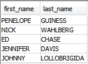

  ​
  Display the first and last name of each actor in a single column in upper case letters. Name the column Actor Name.


  ```sql
  select first_name || ' ' || last_name Actor_Name 
    from actor limit 5;
  ```

  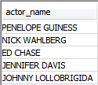


### Query group 2

- You need to find the id, first name, and last name of an actor, of whom you know only the first name of "Joe." What is one query would you use to obtain this information?

  ```sql
  select actor_id, first_name, last_name
    from actor where first_name like 'Joe.';
  ```

  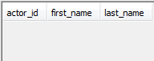


- Find all actors whose last name contain the letters GEN. Make this case insensitive.

  ```sql
  select actor_id, first_name, last_name
    from actor where last_name ilike '%GEN%';
  ```

  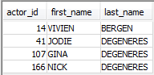


- Find all actors whose last names contain the letters LI. This time, order the rows by last name and first name, in that order. Make this case insensitive.

  ```sql
  select last_name,first_name 
    from actor 
   where last_name ilike '%LI%' 
   order by last_name,first_name;
  ```

  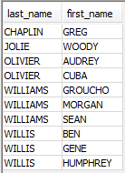


- Using IN, display the country_id and country columns of the following countries: Afghanistan, Bangladesh, and China.

  ```sql
  select country_id, country 
    from country 
   where country in ('Afghanistan','Bangladesh','China');
  ```

  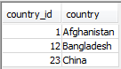


### Query group 3

- Add a middle_name column to the table actor. Specify the appropriate column type.

  ```sql
  alter table actor add column middle_name varchar(50);
  ```

  ```sql
  select * from actor limit 5;
  ```

  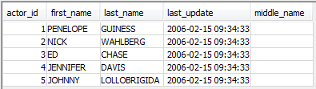


- You realize that some of these actors have tremendously long last names. Change the data type of the middle_name column to something that can hold more than varchar.

  [See this article on character data types](https://www.depesz.com/2010/03/02/charx-vs-varcharx-vs-varchar-vs-text/)

  ```sql
  alter table actor alter column middle_name type text;
  ```

  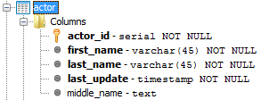

  ​
  Now write a query that would remove the middle_name column.

  ```sql
  alter table actor drop column middle_name;
  ```

  ```sql
  select * from actor limit 5;
  ```

  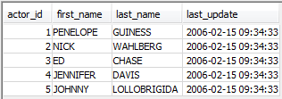


### Query group 4

- List the last names of actors, as well as how many actors have that last name.


  ```sql
  select last_name, count(*) 
    from actor
   group by last_name
   order by last_name limit 5;
  ```

  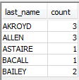


- List last names of actors and the number of actors who have that last name, but only for names that are shared by at least two actors

  ```sql
  select last_name, count(*)
    from actor
   group by last_name
  having count(*) > 1
   order by last_name limit 5;
  ```

  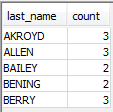

  ​

  Oh, no! The actor HARPO WILLIAMS was accidentally entered in the actor table as GROUCHO WILLIAMS. Write a query to fix the record.

  ```sql
  select * 
    from actor
   where first_name = 'GROUCHO'
     and last_name = 'WILLIAMS';
  ```

  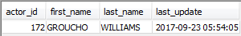

  ```sql
  update actor set first_name = 'HARPO'
   where first_name = 'GROUCHO'
     and last_name = 'WILLIAMS';
  ```

  ```sql
  select * 
    from actor
   where first_name = 'HARPO'
     and last_name = 'WILLIAMS';
  ```

  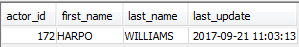


  ```sql
  commit;
  ```

- Perhaps we were too hasty in changing GROUCHO to HARPO. It turns out that GROUCHO was the correct name after all! 

  - **In a single query:**
  - if the first name of the actor is currently HARPO, change it to GROUCHO.
  - Otherwise, change the first name to MUCHO GROUCHO, as that is exactly what the actor will be with the grievous error. 
  - BE CAREFUL NOT TO CHANGE THE FIRST NAME OF EVERY ACTOR TO MUCHO GROUCHO
    (Hint: update the record using a unique identifier.)

  ```sql
  select * 
    from actor
   where first_name in ('HARPO', 'GROUCHO');
  ```

  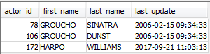


  ```sql
  select case
           when first_name = 'GROUCHO' then 'MUCHO GROUCHO'
           when first_name = 'HARPO' then 'GROUCHO'
           else first_name
         end as fname
    from actor 
   where first_name in ('HARPO', 'GROUCHO');
  ```

  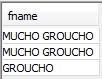


  ```sql
  update actor set first_name =
        case 
          when first_name = 'GROUCHO' then 'MUCHO GROUCHO'
          when first_name = 'HARPO' then 'GROUCHO'
        end 
   where first_name in ('HARPO', 'GROUCHO');
  ```

  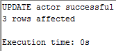

  ​
  ```sql
  select *
    from actor
   where first_name like '%GROUCHO';
  ```


  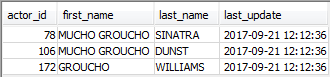


  ```sql
  commit;
  ```


### Query group 5 - Please include examples and answer questions in plain English.

- What’s the difference between a left join and a right join. 

  A left join returns all the rows of the left table and those in the right table where the joining column(s) match.  A right join is the same but with all the right table rows returned and those matching to the left table rows on the joining column(s).

- What about an inner join and an outer join? 

  An inner join is the intersection of the two joining tables where joining columns match.  An outer join returns all rows that match in the right or left  tables.

- When would you use a right join?

  When you want all rows from the right table and those matching rows in the left table.

- When would you use an inner join over an outer join?

  An inner join would be best when you only want rows that have matching join columns in both tables or the
  the intersection of the tables.

- What’s the difference between a left outer and a left join?

  No difference.  They are the same join.

  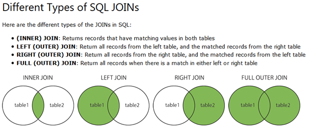


  [**Image from w3schools**](https://www.w3schools.com/sql/sql_join.asp)


- When would you use rank? 

  Use Rank() to assign a rank number based on the over (partition col order by col) clause to associate a value with the grouping.  This groups the same values within each rank number, and between groups the rank numbers can jump to show the relative position of the next group.

  ```sql
  select f.title, f.rental_duration, rank() 
    over (order by rental_duration desc) 
    from film f;
  ```

- What about dense_rank?

  Dense rank() is similar to rank() and will return the rows with a rank number based on the over (partition col order by col) clause.  This groups the same values within with the same rank number so you can easily see the relative position.  Unlike rank(), dense_rank numbers don't jump, so when the group changes the rank number increments by 1

  ```sql
  select f.title, f.rental_duration, dense_rank() 
    over (order by rental_duration desc) 
    from film f;
  ```

- When would you use a subquery in a select?

  You could use a subquery when you need aggregate data, to compare values in the same column, or to use a different view of a table as a joining table.  

  ```sql
  select c1.first_name, c1.last_name,
         (select round(avg(p2.amount),2) 
            from payment p2
           where c1.customer_id = p2.customer_id) avg_pymt	
    from customer c1;
  ```

- When would you use a group by?

  Use a group by when you want to aggregate the values within the values of the group by column or columns.

  ```sql
  select last_name, count(*) 
    from actor
   group by last_name order by last_name;
  ```

- Describe how you would do data reformatting

  You can concatenate columns using SQL, ||, single quotes, and spaces in a select statement.  You can add other characters, words, and phrases within the single quotes.

  ```sql
  select first_name || ' ' || last_name as Actor_Name 
    from actor;
  ```

- When would you use a with clause?

  You can use a with clause when you want to can create an (in-line) view of a table or tables without creating a permanent view in the database.

  ```sql
  WITH actor_film AS(
  select a.first_name, a.last_name, f.title, f.film_id, a.actor_id 
    from actor a
  left join film_actor fa
  on a.actor_id = fa.actor_id
  left join film f
  on f.film_id = fa.film_id
  order by f.title, a.first_name, a.last_name) 
  select first_name, last_name, title 
    from actor_film;
  ```


### Query group 6
- Use a JOIN to display the first and last names, as well as the address, of each staff member. Use the tables staff and address:

  ```sql
  select s.first_name,s.last_name,a.address,
  a.district, c.city, cty.country	
    from staff s
  left join address a
  on s.address_id = a.address_id
  left join city c
  on a.city_id = c.city_id
  left join country cty
  on c.country_id = cty.country_id;
  ```

  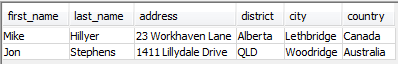


- Use a JOIN to display the total amount rung up by each staff member in January of 2007. Use tables staff and payment. You’ll have to google for this one, we didn’t cover it explicitly in class. 

  ```sql
  select s.staff_id, s.first_name, s.last_name, 
    sum(p.amount) as total_sales_jan2007
    from staff s
  left join payment p 
  on s.staff_id = p.staff_id
   where p.payment_date between '2007-01-01' and '2007-01-31'
   group by s.staff_id, s.first_name, s.last_name;
  ```

  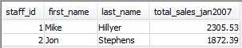

- List each film and the number of actors who are listed for that film. Use tables film_actor and film. Use inner join.

  ```sql
  select f.title, count(filma.actor_id) as actor_count
    from film f
  inner join film_actor filma
  on f.film_id = filma.film_id
   group by f.title
   order by f.title limit 5;
  ```

  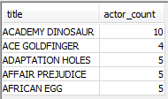


- How many copies of the film Hunchback Impossible exist in the inventory system?

  ```sql
  select f.title, count(inv.film_id)
    from film f
  left join inventory inv
  on f.film_id = inv.film_id
   where lower(f.title) = 'hunchback impossible'
   group by f.title;
  ```

  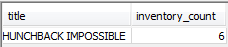


- Using the tables payment and customer and the JOIN command, list the total paid by each customer. List the customers alphabetically by last name:

  ```sql
  select c.first_name, c.last_name,c.customer_id,
         round(sum(p.amount),2) as total_rental_fees
    from customer c
  left join payment p
  on c.customer_id = p.customer_id
   group by c.first_name, c.last_name, c.customer_id
   order by c.last_name asc limit 5;
  ```

  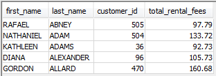

### Query group 7
- The music of Queen and Kris Kristofferson have seen an unlikely resurgence. As an unintended consequence, films starting with the letters K and Q have also soared in popularity. display the titles of movies starting with the letters K and Q whose language is English.

  ```sql
  select f.title, l.name as movie_language 
    from film f
  left join language l
  on f.language_id = l.language_id
   where l.name = 'English'
     and (f.title like 'K%' or f.title like 'Q%')
   order by 1;
  ```

  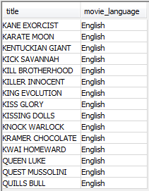

- Use subqueries to display all actors who appear in the film Alone Trip.

  ```sql
  select f.title as movie_title, 
         fa_a.first_name as actor_first_name,
         fa_a.last_name as actor_last_name
    from (select fa.*, a.*
            from film_actor fa
          left join actor a
          on fa.actor_id = a.actor_id)fa_a 
  left join film f
  on fa_a.film_id = f.film_id
   where lower(f.title) like 'alone trip'
   order by 3;
  ```

  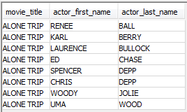

- You want to run an email marketing campaign in Canada, for which you will need the names and email addresses of all Canadian customers. Use joins to retrieve this information.

  ```sql
  select c.first_name, c.last_name, c.email, a.address, a.district, 
         a.postal_code, ct.city, cty.country
    from customer c
  left join address a
  on c.address_id = a.address_id
  left join city ct
  on a.city_id = ct.city_id
  left join country cty
  on ct.country_id = cty.country_id
   where country = 'Canada';
  ```

  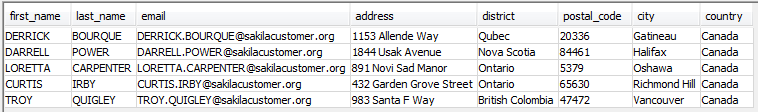

- Sales have been lagging among young families, and you wish to target all family movies for a promotion. Identify all movies categorized as a family film.
  Now we mentioned family film, but there is no family film category. There’s a category that resembles that. In the real world nothing will be exact.

  **Rated G: General Audiences – all ages admitted.**

  ```sql
  select f.title, f.rating, f.length, f.description 
    from film f
   where f.rating = 'G' 
   order by f.title limit 5;
  ```

  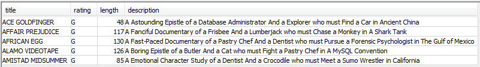

  ```sql
  select f.title, f.rating, c.name, f.description
    from film f
  left join film_category fc
  on f.film_id = fc.film_id
  left join category c
  on fc.category_id = c.category_id
   where name in ('Children','Family','Animation','Music','Classics','Comedy')
     and f.rating = 'G'
   order by 1 limit 5;
  ```

  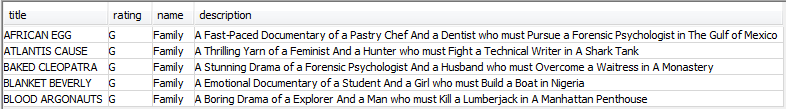


- Display the most frequently rented movies in descending order.

  ```sql
  select f.title, count(r.rental_date) as rental_count
    from rental r
  left join inventory i
  on r.inventory_id = i.inventory_id
  left join film f
  on i.film_id = f.film_id
   group by f.title
   order by 2 desc limit 10;
  ```

  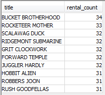


- Write a query to display how much business, in dollars, each store brought in.

  ```sql
  select s.store_id, ct.city, cty.country, 
         sum(p.amount) as total_sales
    from payment p
  left join staff s
  on p.staff_id = s.staff_id
  left join store st
  on s.store_id = st.store_id
  left join address a
  on st.address_id = a.address_id
  left join city ct
  on a.city_id = ct.city_id
  left join country cty
  on ct.country_id = cty.country_id
   group by 1,2,3
   order by 1;
  ```

  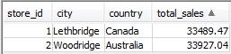


- Write a query to display for each store its store ID, city, and country.

  ```sql
  select distinct s.store_id, ct.city, cty.country
    from payment p
  left join staff s
  on p.staff_id = s.staff_id
  left join store st
  on s.store_id = st.store_id
  left join address a
  on st.address_id = a.address_id
  left join city ct
  on a.city_id = ct.city_id
  left join country cty
  on ct.country_id = cty.country_id
   order by 1;
  ```

  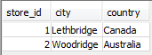


- List the top five genres in gross revenue in descending order.

  ```sql
  select c.name as genre, 
         round(sum(p.amount),2) as gross_revenue
    from film f
  left join film_category fc
  on f.film_id = fc.film_id
  left join category c
  on fc.category_id = c.category_id
  left join inventory i
  on f.film_id = i.film_id
  left join rental r
  on i.inventory_id = r.inventory_id
  left join payment p
  on r.rental_id = p.rental_id
   group by c.name
   order by 2 desc limit 5;
  ```

  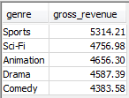


### Query group 8
- In your new role as an executive, you would like to have an easy way of viewing the Top five genres by gross revenue. Use the solution from the problem above to create a view. 

  ```sql
  create or replace view top_5_genre_revenue AS
    select c.name as genre, round(sum(p.amount),2) as gross_revenue
      from film f
    left join film_category fc
    on f.film_id = fc.film_id
    left join category c
    on fc.category_id = c.category_id
    left join inventory i
    on f.film_id = i.film_id
    left join rental r
    on i.inventory_id = r.inventory_id
    left join payment p
    on r.rental_id = p.rental_id
     group by c.name
     order by 2 desc;
  ```

  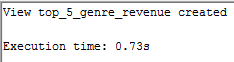


- How would you display the view that you created in previous sql statement?

  ```sql
  select * from top_5_genre_revenue limit 5;
  ```

  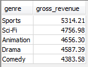


- You find that you no longer need the view top_five_genres. Write a query to delete it.

  ```sql
  drop view if exists top_5_genre_revenue;
  ```

  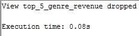


## Appendix 

### Tables
- actor

- address

- category

- city

- country

- customer

- film

- film_actor

- film_category

- film_text (not in the database)

- inventory

- language

- payment

- payment_p2007_01

- payment_p2007_02

- payment_p2007_03

- payment_p2007_04

- payment_p2007_05

- payment_p2007_06

- rental

- staff

- store

### Views
- actor_info

- actors_and_films

- customer_list

- film_list

- nicer_but_slower_film_list

- sales_by_film_category

- sales_by_store

- staff_list